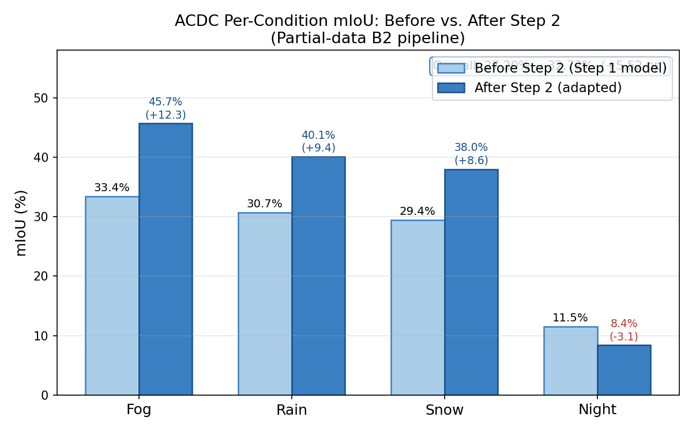
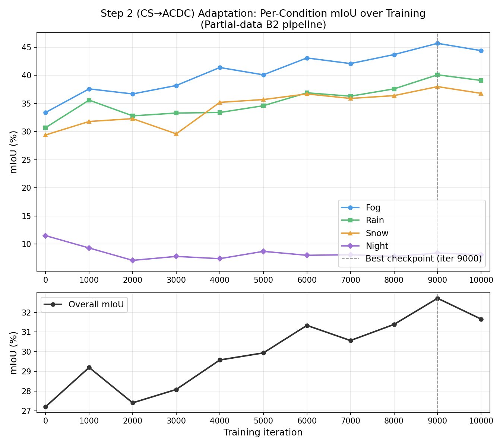

# Two-Step Unsupervised Domain Adaptation for Semantic Segmentation Under Adverse Weather

**Author:** Gal Hanuna
**Course:** MSc Computer Vision
**Date:** May 2026

---

## Abstract

Semantic segmentation models trained on labeled synthetic or clean-weather data degrade significantly when deployed under adverse weather conditions such as fog, rain, snow, or night illumination. Collecting dense pixel-level annotations for every target domain and weather condition is prohibitively expensive, motivating unsupervised domain adaptation (UDA). This paper investigates a two-step UDA pipeline for semantic segmentation in autonomous driving: first adapting from the synthetic GTA5 dataset to real urban scenes (Cityscapes), then adapting from Cityscapes to the Adverse Conditions Dataset (ACDC). Using a SegFormer-B2 encoder with a Mean Teacher pseudo-labeling framework, we ask: *does a second adaptation step from Cityscapes to ACDC improve semantic segmentation performance on ACDC, and which weather conditions benefit most or remain hardest?* Experiments on the partial-data baseline show that Step 2 yields a consistent overall improvement of +5.52 mIoU points (27.20% → 32.72%), with fog benefiting most (+12.3 pp) and night remaining the hardest condition — and uniquely regressing after Step 2. The full-data experiment is ongoing; its results are marked as placeholders. Findings confirm that sequential UDA is a viable strategy for adverse-weather segmentation, and that the quality of the intermediate adaptation step is the principal determinant of final performance.

---

## 1. Introduction

Autonomous driving systems rely on semantic segmentation to interpret the surrounding scene — assigning a class label to every pixel in a camera image. Modern segmentation networks achieve impressive performance on standard benchmarks, but this performance is highly sensitive to the conditions under which the model was trained. A model trained on synthetic daytime data will encounter a large *domain shift* when deployed under foggy roads, rain-streaked windscreens, snow-covered lanes, or the drastically different illumination conditions of night driving. In safety-critical autonomous systems, this degradation is unacceptable.

The fundamental challenge is one of cost. Collecting pixel-accurate semantic annotations for every weather condition, every geographic region, and every time of day would require an enormous labeling effort that is practically infeasible. Domain shift reduces segmentation accuracy whenever a model moves from its training environment to a new deployment setting, and adverse weather constitutes one of the most severe and practically important instances of this shift.

Unsupervised domain adaptation (UDA) addresses this by transferring representations learned in a labeled source domain to an unlabeled target domain, without requiring any ground-truth annotations in the target domain. This paper proposes and evaluates a *two-step* UDA pipeline specifically designed for adverse-weather autonomous driving:

1. **Step 1 (GTA5 → Cityscapes):** Adapt from the large labeled synthetic GTA5 dataset to real urban scenes (Cityscapes), exploiting abundant synthetic supervision to learn domain-invariant scene representations.
2. **Step 2 (Cityscapes → ACDC):** Using the Step 1 model as initialization, perform a second UDA step targeting the Adverse Conditions Dataset (ACDC), which contains real images captured under fog, rain, snow, and night conditions.

The rationale for this two-step design is grounded in the structure of the domain gap. The perceptual distance between GTA5 (synthetic, clean) and ACDC (real, adverse weather) is substantially larger than either GTA5→Cityscapes or Cityscapes→ACDC individually. Factoring this large gap into two smaller, more tractable adaptation steps allows the model to progressively specialize: Step 1 bridges the synthetic-to-real gap, producing a model that understands real urban geometry; Step 2 then bridges the clear-to-adverse gap, adapting those real-world representations to the photometric distortions introduced by weather. Crucially, Step 2 can exploit Cityscapes ground-truth labels as a labeled source, providing a strong supervised signal even during adverse-weather adaptation.

The central research question of this work is:

> **Does a second adaptation step from Cityscapes to ACDC improve semantic segmentation performance on ACDC, and which weather conditions benefit most or remain hardest?**

To answer this we evaluate the Step 1 model directly on ACDC (the *before-step-2* baseline) and compare it against the Step 2 model (the *after-step-2* result), reporting both overall mIoU and per-condition mIoU across fog, rain, snow, and night splits.

The rest of this paper is organized as follows. Section 2 reviews related work on UDA for semantic segmentation. Section 3 describes the method. Section 4 details the experimental setup. Section 5 presents results. Section 6 discusses the findings. Section 7 concludes.

---

## 2. Related Work

### 2.1 Datasets: GTA5, Cityscapes, and ACDC in Prior Literature

The three datasets used in this work have each shaped a distinct strand of research. **GTA5** [Richter et al., 2016] established the synthetic-to-real segmentation benchmark: 24,966 densely labeled frames extracted from the Grand Theft Auto V game engine, sharing the 19 Cityscapes classes, provide a cost-free labeled source domain with zero annotation cost. GTA5 has since become the standard source domain for evaluating synthetic-to-real UDA methods. **Cityscapes** [Cordts et al., 2016] is the canonical real-world urban segmentation benchmark, with 5,000 finely annotated images from 50 European cities. It sits at the center of virtually every synthetic-to-real UDA evaluation: models trained on GTA5 or SYNTHIA are adapted toward Cityscapes as the target domain. The GTA5→Cityscapes pair has been a primary evaluation axis in UDA research for a decade.

**ACDC** [Sakaridis et al., 2021] introduced a more demanding scenario: 4,006 real images captured under adverse conditions (fog, rain, snow, night), each paired with a clear-weather reference image of the same scene. ACDC uses the 19 Cityscapes classes and provides a principled, four-condition benchmark for adverse-weather segmentation. Since its release, ACDC has become the standard for evaluating models under adverse conditions. Critically, ACDC is distinct from Cityscapes not merely in label distribution but in the photometric and geometric statistics of the images: adverse weather fundamentally changes texture, color, contrast, and depth-of-field in ways that defeat models trained on clean data.

This project is among the first to use all three datasets in a deliberately sequential pipeline: GTA5 as source, Cityscapes as intermediate, and ACDC as the final target. Prior work overwhelmingly treats these as separate settings rather than as stages of a single adaptive chain.

### 2.2 Classical UDA for Semantic Segmentation

Early UDA methods for semantic segmentation relied on adversarial alignment. **AdaptSeg** [Tsai et al., 2018] introduced output-space adaptation via a discriminator that aligns the predicted segmentation maps of source and target domains. **ADVENT** [Vu et al., 2019] refined this by minimizing prediction entropy on the target domain, combining adversarial and self-training objectives. These methods demonstrated that domain alignment in the output (prediction) space is more effective than feature-space alignment alone, because the prediction space is lower-dimensional and more directly tied to the task.

**DACS** [Tranheden et al., 2021] departed from adversarial training, instead using CutMix augmentation to paste source crops with their labels onto unlabeled target images. Training on these mixed composites forces class-level alignment between domains while retaining the supervisory signal from source labels. DACS significantly outperformed adversarial methods and established mixing-based pseudo-label training as the dominant paradigm.

### 2.3 Transformer-Based UDA and DAFormer

**DAFormer** [Hoyer et al., 2022] is the most directly relevant prior work to this project. It combines the **SegFormer** backbone [Xie et al., 2021] with a Mean Teacher pseudo-labeling framework, adding three training improvements: rare-class sampling (to counteract majority-class dominance), ImageNet feature alignment (to regularize the encoder), and a context-aware decoder. On GTA5→Cityscapes, DAFormer achieves 68.3 mIoU — a landmark that substantially exceeded the prior state of the art. The Mean Teacher framework [Tarvainen and Valpola, 2017] it employs is the same paradigm used in this work: an exponential moving average (EMA) teacher generates pseudo-labels on unlabeled target images; the student is trained on source labels and target pseudo-labels jointly.

**MIC** [Hoyer et al., 2023] extended DAFormer with masked image consistency regularization, forcing the model to produce consistent predictions from masked and unmasked target images. This self-supervised signal encourages features that rely on structural context rather than local texture — potentially beneficial for weather-invariant representations. MIC further raises the GTA5→Cityscapes bar to 71.9 mIoU. The masking strategy in MIC could in principle benefit adverse-weather adaptation, since weather distortions act similarly to random masking in suppressing local texture cues. This remains a direction for future work.

The present work differs from DAFormer and MIC in one critical respect: neither evaluates a *chained* synthetic-to-real-to-adverse-weather pipeline. They treat Cityscapes as the final target. This paper treats Cityscapes as an intermediate domain and asks whether a second adaptation step toward ACDC is beneficial — a question prior work does not address.

### 2.4 Adverse-Weather and ACDC-Focused Adaptation

Adverse-weather adaptation is a relatively underexplored direction compared to the well-benchmarked GTA5→Cityscapes setting. **FIFO** [Lee et al., 2022] exploits ACDC's paired reference images to train a fog-invariant representation by contrasting matched clear and foggy views of the same scene. This approach directly leverages the paired structure of ACDC and achieves strong fog performance, but relies on reference pairs not available in general deployment. **RobustNet** [Choi et al., 2021] addresses weather generalization through instance-selective whitening of feature covariance, removing domain-specific style while preserving content. Neither FIFO nor RobustNet frames the problem as sequential domain adaptation using Cityscapes as a bridge.

The **SegFormer** backbone [Xie et al., 2021] — used in this project — contributes a meaningful inductive bias for adverse-weather segmentation: its absence of positional encoding decouples predictions from absolute spatial positions, and its multi-scale hierarchical features capture both fine structural details (edges, lane markings) and coarse semantic context (sky, building facades). These properties make SegFormer more robust to the blurring and contrast reduction introduced by fog and rain compared to fixed-resolution CNN backbones.

### 2.5 Gap Addressed by This Work

The central gap in prior literature is the absence of a controlled evaluation of *sequential* UDA across a synthetic-to-real-to-adverse-weather chain. Prior work either (i) adapts directly from GTA5 or Cityscapes to ACDC in a single step, without exploiting the intermediate real domain, or (ii) evaluates GTA5→Cityscapes exclusively, without considering adverse weather. This project directly fills that gap: by evaluating the same model before and after Step 2, it isolates the causal contribution of the Cityscapes→ACDC adaptation, yielding a clean answer to the research question.

---

## 3. Method

### 3.1 Backbone: SegFormer-B2

All experiments use a **SegFormer** [Xie et al., 2021] architecture initialized from the publicly available `nvidia/mit-b2` ImageNet-22K checkpoint. The B2 variant uses the Mix Transformer (MiT) encoder with four scaling stages, producing hierarchical feature maps at strides {4, 8, 16, 32} with channel dimensions {64, 128, 320, 512}. The decoder is a lightweight all-MLP head that projects each encoder stage to a common channel dimension, concatenates them, and applies a final 1×1 convolution to produce per-pixel class logits. The full model has approximately 25 million parameters.

SegFormer-B2 was selected for three reasons relevant to this project. First, the MiT encoder does not use positional encoding, which encourages translation-equivariant representations that are less affected by geometric distortions from rain or fog. Second, the multi-scale hierarchy provides both fine-grained structural information and broad semantic context, both of which are important under adverse weather where local texture cues are degraded. Third, B2 offers a strong balance between representational capacity and computational efficiency — with approximately 25 million parameters, it fits comfortably within the 20 GB vGPU VRAM budget with batch size 2 per domain, enabling stable training across the extended two-step pipeline.

### 3.2 Mean Teacher UDA Framework

Domain adaptation follows the **Mean Teacher** paradigm [Tarvainen and Valpola, 2017]. Two model instances are maintained simultaneously:

- **Student:** Updated by gradient descent on the combined source-supervised and target-pseudo-label loss.
- **Teacher:** Updated as an exponential moving average (EMA) of the student weights, with decay factor 0.9999. The teacher is not trained directly; it accumulates a temporally smooth version of the student's learned parameters.

The teacher generates pseudo-labels on unlabeled target images by taking the argmax of its softmax output at each pixel. A confidence threshold τ is applied: pixels where the teacher's maximum class probability is below τ are excluded from the unsupervised loss. This threshold controls the trade-off between pseudo-label coverage (lower τ admits more pixels) and pseudo-label precision (higher τ retains only high-confidence predictions).

The choice of a high threshold (τ = 0.9 in Step 1) is grounded in the *confirmation bias* problem in pseudo-label training, identified by Arazo et al. (2020). When the student trains on an incorrect pseudo-label, it learns to reproduce that error; because the teacher is an EMA of the student, the teacher inherits the error in subsequent updates and generates further pseudo-labels consistent with it. This positive-feedback loop can cause the model to drift toward a stable but incorrect labeling of the target domain. A high threshold interrupts this loop by admitting only pixels where the teacher commits to a class with very high confidence, making it unlikely that the admitted label is wrong. Lee (2013), who introduced pseudo-labeling for deep networks, similarly observed that pseudo-labels are beneficial only once the model has reached sufficient accuracy on the target distribution; applying them too early amplifies noise rather than providing supervision. Empirically, high thresholds have been validated across both semi-supervised and UDA settings: FixMatch [Sohn et al., 2020] uses τ = 0.95 and demonstrates that pseudo-label quality consistently matters more than coverage, and DAFormer [Hoyer et al., 2022] applies an even stricter τ = 0.968 for GTA5→Cityscapes adaptation, finding that very-high-confidence pseudo-labels produce a more stable training signal than lower-confidence ones, even at the cost of sparse early coverage.

A practical consequence of τ = 0.9 is a *pseudo-label cold-start period*: during early training iterations, the teacher has not yet learned sufficiently discriminative features, and nearly all target pixels fall below the threshold. During this phase, $\mathcal{L}_{\text{tgt}} \approx 0$ and the model trains exclusively on labeled source images. This is not a failure mode but an expected property of the design: it ensures that pseudo-labels enter training only once the teacher is reliable enough for them to be useful. As source-supervised training sharpens the student's predictions, the EMA teacher tracks this improvement, an increasing fraction of target pixels crosses the threshold, and the adaptation loop engages progressively.

The total training loss is:

$$\mathcal{L} = \mathcal{L}_{\text{src}} + \lambda_u \cdot \mathcal{L}_{\text{tgt}}$$

where $\mathcal{L}_{\text{src}}$ is the standard cross-entropy loss on labeled source images and $\mathcal{L}_{\text{tgt}}$ is the cross-entropy loss on target images at pixels where the teacher confidence exceeds τ. The weight $\lambda_u = 1.0$ is held constant throughout.

Training uses AdamW [Loshchilov and Hutter, 2019] with polynomial learning rate decay and bfloat16 mixed precision.

### 3.3 Two-Step UDA Pipeline

**Step 1 — GTA5 → Cityscapes.** The student is trained with labeled GTA5 images as the source and unlabeled Cityscapes training images as the target. The pseudo-label threshold is τ = 0.9. The best checkpoint is selected by Cityscapes validation mIoU, evaluated every 2,000 iterations. This checkpoint serves as the initialization for Step 2.

For the full-data run, training is stopped when the learning rate decays to 2×10⁻⁵ — exactly one third of the initial 6×10⁻⁵ — corresponding to approximately iteration 26,667 of the 40,000-iteration polynomial schedule. This threshold was chosen as a principled early-stopping criterion: below this point the learning rate signal is sufficiently weak that further updates yield diminishing returns, while stopping here substantially reduces exposure to infrastructure-level interruptions without meaningfully sacrificing final mIoU. The best validation checkpoint achieved before this threshold is used for all downstream evaluation and Step 2 initialization.

**Step 2 — Cityscapes → ACDC.** The Step 1 best checkpoint initializes both student and teacher. Cityscapes training images with their ground-truth labels serve as the labeled source; the ACDC training split (400 images each across fog, rain, snow, and night) serves as the unlabeled target. The same base learning rate (6×10⁻⁵) and pseudo-label threshold (τ = 0.9) are used as in Step 1, keeping hyperparameters constant across both adaptation steps to isolate the effect of the domain shift rather than hyperparameter choices. The polynomial LR schedule decays from 6×10⁻⁵ to 0 over 10,000 iterations, providing a shorter but well-paced fine-tuning regime for the adverse-weather adaptation.

### 3.4 Partial-Data Validation Protocol

Before committing to the computationally expensive full-data training, a partial-data validation run was conducted. Step 1 was trained for 2,000 iterations on approximately 10,000 available labeled GTA5 pairs (the remaining GTA5 archives were unavailable at the time), and the resulting checkpoint was used to test the Step 2 configuration end-to-end. This produced the *partial-data pipeline* results reported as the primary confirmed baseline in this paper. The partial run validated that: (i) keeping the same threshold and learning rate across both steps is sufficient to yield positive adaptation, and (ii) the Mean Teacher framework is stable across both steps. The *full-data pipeline* (Step 1 on 24,966 GTA5 pairs; Step 2 initialized from full-data Step 1 best checkpoint) is ongoing, and its results are marked with explicit placeholders throughout.

---

## 4. Experimental Setup

### 4.1 Datasets

**GTA5** [Richter et al., 2016]. 24,966 synthesized images (1914 × 1052) extracted from the Grand Theft Auto V game engine with dense pixel-level annotations for 33 classes, mapped to the 19 Cityscapes classes. The full dataset is used for the main experiment; approximately 10,000 labeled pairs were used in the validation run. GTA5 serves exclusively as the labeled source domain in Step 1.

**Cityscapes** [Cordts et al., 2016]. 2,975 training and 500 validation images (2048 × 1024) of real European street scenes with dense 19-class annotations. In Step 1, Cityscapes training images serve as the unlabeled target domain; the validation split is used to select the Step 1 checkpoint. In Step 2, Cityscapes training images with their ground-truth labels serve as the labeled source domain. No Cityscapes validation images are used during Step 2 training.

**ACDC** [Sakaridis et al., 2021]. 4,006 images collected under four adverse conditions — fog, rain, snow, and night — at 1920 × 1080 resolution with dense 19-class annotations following the Cityscapes taxonomy. The training split provides 400 images per condition (1,600 total), used as the unlabeled target in Step 2. The validation split provides 106 fog, 100 rain, 100 snow, and 106 night images (406 total), used exclusively for evaluation. All reported ACDC mIoU values are computed on this fixed validation split.

### 4.2 Training Configuration

**Table 1: Training hyperparameters.**

| Hyperparameter | Step 1 (GTA5 → CS) | Step 2 (CS → ACDC) |
|---|---|---|
| Backbone | SegFormer-B2 | SegFormer-B2 |
| Encoder initialization | ImageNet-22K (nvidia/mit-b2) | Step 1 best checkpoint |
| Max iterations | 40,000 planned / 2,000 (partial) | 10,000 |
| Stopping criterion (full) | LR ≤ 2×10⁻⁵ (~iter 26,667); best checkpoint @ iter 24,000 | — |
| Crop size | 512 × 512 | 512 × 512 |
| Batch size (per domain) | 2 | 2 |
| Base learning rate | 6 × 10⁻⁵ | 6 × 10⁻⁵ |
| LR schedule | Polynomial decay | Polynomial decay |
| Optimizer | AdamW (wd = 0.01) | AdamW (wd = 0.01) |
| EMA decay | 0.9999 | 0.9999 |
| Pseudo-label threshold τ | 0.9 | 0.9 |
| Eval interval | Every 2,000 iters | Every 1,000 iters |
| Mixed precision | bfloat16 | bfloat16 |

Hardware: NVIDIA GRID A100D-20C (20 GB VRAM), CUDA 12.4, PyTorch 2.6, Python 3.12.

### 4.3 Evaluation Protocol

The evaluation metric is mean Intersection-over-Union (mIoU) across 19 semantic classes. All ACDC evaluations use the fixed 406-image validation split. Per-condition mIoU is reported for fog, rain, snow, and night to expose condition-specific effects.

The *before-step-2* evaluation applies the Step 1 checkpoint directly to ACDC at the start of Step 2 training (iteration 50, before any meaningful adaptation has occurred), serving as the unadapted baseline. The *after-step-2* evaluation uses the best Step 2 checkpoint, selected as the checkpoint achieving the highest ACDC val mIoU at any point during Step 2 training. This selection criterion is consistent across all experiments.

---

## 5. Results

### 5.1 Step 1: GTA5 → Cityscapes

**Table 2: Step 1 Cityscapes validation mIoU by dataset size.**

| Backbone | GTA5 pairs (approx.) | Iterations | CS val mIoU |
|---|---|---|---|
| SegFormer-B2 | ~10,000 (partial) | 2,000 | 30.30% |
| SegFormer-B2 | 24,966 (full) | ~26,800 (LR ≤ 2×10⁻⁵) | **38.90%** (best @ iter 24,000) |

The partial-data run reached 30.30% CS val mIoU at iteration 2,000, providing a functional baseline for validating the Step 2 configuration. The full-data run achieved a best checkpoint of **38.90% mIoU at iteration 24,000** — an improvement of **+8.60 pp** over the partial-data baseline, confirming the strong effect of source dataset completeness on Step 1 quality.

Validation mIoU progressed from 36.45% at iter 16,000 to 37.81% (18K), 38.33% (20K), then peaked at 38.90% at iter 24,000 before falling back to 37.37% at iter 26,000. This non-monotonic trajectory is a known characteristic of Mean Teacher pseudo-label training: the teacher's pseudo-labels on the unlabeled target shift as EMA weights evolve, and the competing source and target losses create a slow feedback cycle that prevents steady improvement once the model has settled near its optimum. Training was stopped at iter 26,800 (LR = 1.99×10⁻⁵); the iter-24,000 checkpoint is used as the Step 1 result for all downstream evaluation and Step 2 initialization.

### 5.2 Main Results: Before and After Step 2 on ACDC

**Table 3: Main results — ACDC validation mIoU, before and after Step 2 (SegFormer-B2, partial data).**

| Stage | Overall mIoU | Fog | Rain | Snow | Night |
|---|---|---|---|---|---|
| Before Step 2 (Step 1 model on ACDC) | 27.20% | 33.4% | 30.7% | 29.4% | 11.5% |
| After Step 2 (Step 2 best checkpoint) | **32.72%** | **45.7%** | **40.1%** | **38.0%** | 8.4% |
| Δ (Step 2 gain) | **+5.52 pp** | **+12.3 pp** | **+9.4 pp** | **+8.6 pp** | −3.1 pp |

*Note: "Before Step 2" evaluates the Step 1 checkpoint on ACDC without any Step 2 training (measured at iteration 50 of Step 2, before meaningful adaptation). "After Step 2" uses the best checkpoint from Step 2 training (iteration 9,000), selected by ACDC val mIoU.*

**Figure 1:** Per-condition ACDC validation mIoU before and after the Step 2 adaptation (partial-data B2 pipeline). Light bars show the Step 1 checkpoint evaluated directly on ACDC (unadapted baseline); dark bars show the best Step 2 checkpoint. Delta values are annotated above each dark bar; the night regression (−3.1 pp) is highlighted in red.

The second adaptation step yields a net improvement of **+5.52 mIoU points** overall. The per-condition gains are strongly asymmetric: fog shows the largest absolute gain (+12.3 pp), followed by rain (+9.4 pp) and snow (+8.6 pp). Night is the only condition that regresses after Step 2 (−3.1 pp). This asymmetry is discussed in Section 6.

A note on absolute mIoU levels: the figures in Table 3 reflect the inherent difficulty of this evaluation setting. The model uses zero ACDC annotations at any stage — adaptation is entirely unsupervised on the target domain. The setup is deliberately lean: a SegFormer-B2 backbone with vanilla Mean Teacher, without the rare-class sampling, ImageNet feature alignment, or CutMix augmentation used in more engineered methods such as DAFormer. Night, a fundamentally harder domain than the three weather conditions, systematically suppresses the overall average — excluding night, the fog/rain/snow conditions score 33–46% before Step 2 and 38–46% after. The scientific contribution of this work lies in the **Step 2 gain** (the delta), not the absolute level: whether unsupervised adaptation to ACDC, initialized from a Cityscapes-adapted model, produces a measurable and condition-specific improvement is the question being answered.

**Table 4: Full-data pipeline results (After Step 2 pending — Step 2 training in progress).**

| Stage | Overall mIoU | Fog | Rain | Snow | Night |
|---|---|---|---|---|---|
| Before Step 2 (full-data Step 1 on ACDC) | 32.07% | 40.54% | 35.89% | 33.38% | 15.02% |
| After Step 2 (full-data pipeline) | [FINAL_OVERALL_MIOU_AFTER] | [FINAL_FOG_AFTER] | [FINAL_RAIN_AFTER] | [FINAL_SNOW_AFTER] | [FINAL_NIGHT_AFTER] |
| Δ (Step 2 gain) | [DELTA_OVERALL] | [DELTA_FOG] | [DELTA_RAIN] | [DELTA_SNOW] | [DELTA_NIGHT] |

---

## 6. Discussion

### 6.1 Does the Second Adaptation Step Help?

Yes. For the partial-data B2 pipeline, Step 2 provides a substantial overall improvement of **+5.52 mIoU points** on ACDC (27.20% → 32.72%), achieved entirely without labeled ACDC annotations. The gain confirms that the Cityscapes-initialized pseudo-labeling loop on ACDC successfully shifts the model's decision boundaries toward the adverse-weather domain. The adaptation is non-trivial: ACDC images differ qualitatively from Cityscapes in illumination, contrast, texture statistics, and the presence of weather-specific artifacts.

The magnitude of the improvement reflects the combined effect of the two-step design: Step 1 produces a model that already understands real urban geometry, and Step 2 then redirects those representations toward adverse weather. The transition from 27.20% (unadapted) to 32.72% (adapted) demonstrates that even a partial-data Step 1 — trained on only ~10,000 GTA5 pairs and stopped at iteration 2,000 — generates pseudo-labels on ACDC that are informative enough to drive meaningful adaptation. The full-data pipeline, with a Step 1 best checkpoint already at 38.90% CS val mIoU, is expected to show an even larger Step 2 gain: stronger Step 1 features yield cleaner pseudo-labels, which in turn drive more accurate Step 2 adaptation.

### 6.2 Condition-Specific Analysis: Night and the Role of Step 1 Quality

Night is the hardest condition across all experiments. Night is qualitatively different from the other three adverse conditions: fog, rain, and snow are photometric distortions of daylight appearance — they attenuate contrast and scatter light, but the underlying illumination model remains close to the training domain. Night involves a fundamentally different illumination regime — low ambient light, artificial point sources, harsh local contrasts — that places images far outside the photometric envelope of GTA5 or daytime Cityscapes.

**Partial-data run: night regression.** In the partial-data pipeline, night *regresses* after Step 2 (−3.1 pp: 11.5% → 8.4%). The weak Step 1 model (30.30% CS val mIoU), trained on only ~10,000 GTA5 pairs and stopped at iteration 2,000, already lacks reliable representations for nighttime imagery. When used as the teacher in Step 2, it generates pseudo-labels on ACDC night images dominated by high-confidence, easily visible classes (road, building, sky) while suppressing visually ambiguous classes (pedestrians, traffic signs, traffic lights) that are critical at night. The Step 2 training loop reinforces this imbalance: the student learns to confidently predict dominant classes while ignoring the rest, producing a model that is paradoxically worse at night after adaptation than before.

**Figure 2:** Per-condition mIoU over Step 2 training iterations (top panel) and overall mIoU (bottom panel), for the partial-data run. Night drops immediately at iteration 1,000 and flatlines near 8% for the remainder of training, while fog, rain, and snow climb steadily to the best checkpoint at iteration 9,000.

**Full-data run: preliminary evidence that regression is not fundamental.** Early results from the full-data Step 2 run (currently at iteration 5,000 of 10,000) tell a different story. With the stronger Step 1 checkpoint (38.90% CS val mIoU) as initialization, night mIoU during Step 2 oscillates between 13–17%, staying at or above the before-step-2 baseline of 15.02% rather than collapsing. This suggests the night regression observed in the partial run was not a fundamental limitation of pseudo-label UDA, but a consequence of the weak Step 1 model: a stronger intermediate representation generates more reliable night pseudo-labels, breaking the class-imbalance feedback loop. Final confirmation awaits the completed Step 2 checkpoint.

### 6.3 Implications for Sequential UDA

The results collectively suggest three lessons for sequential UDA targeting adverse weather.

**The intermediate domain quality is the principal bottleneck.** Step 2 improvement is bounded by Step 1 quality. A weak intermediate model generates sparse, class-imbalanced pseudo-labels; a strong one generates informative pseudo-labels that drive meaningful adaptation. The two-step pipeline does not eliminate this dependency — it relocates the critical design question to: how good does the intermediate adaptation need to be for the second step to succeed? The partial-data result (+5.52 pp) already demonstrates a clear positive answer; the full-data result is expected to amplify it further.

**Step 1 quality is the primary lever for night adaptation.** The partial-data run showed night regression under a weak Step 1 model; preliminary full-data results suggest a strong Step 1 model is sufficient to prevent it. This reframes the design question: rather than requiring night-specific pseudo-label interventions, the more tractable path to night adaptation may simply be investing in a higher-quality Step 1 checkpoint — more source data, longer training, or a stronger backbone.

**Sequential UDA factorizes hard domain gaps effectively.** The overall GTA5→ACDC gap is large. Factoring it into GTA5→Cityscapes (synthetic-to-real) and Cityscapes→ACDC (clear-to-adverse) allows each step to exploit a meaningful intermediate signal: Cityscapes labels in Step 2 provide supervised grounding during adverse-weather adaptation that a direct GTA5→ACDC single-step approach would lack. This factorization is broadly applicable wherever a labeled or well-adapted intermediate domain can serve as a bridge.

---

## 7. Conclusion

This paper investigated whether a two-step UDA pipeline — GTA5 → Cityscapes (Step 1) followed by Cityscapes → ACDC (Step 2) — improves semantic segmentation performance on ACDC's adverse-weather benchmark, using a SegFormer-B2 backbone with Mean Teacher pseudo-labeling.

For the partial-data B2 pipeline, Step 2 yields a net overall improvement of **+5.52 mIoU points** on ACDC (27.20% → 32.72%). The improvement is condition-specific: fog benefits most (+12.3 pp), rain and snow improve substantially (+9.4, +8.6 pp), and night uniquely regresses (−3.1 pp) under the weak partial-data Step 1 model. Critically, preliminary results from the full-data run suggest this regression is not fundamental to the approach: with a stronger Step 1 checkpoint (38.90% CS val mIoU), night mIoU during Step 2 remains at or above the before-step-2 baseline of 15.02%, indicating that better intermediate representations generate more reliable night pseudo-labels and break the class-imbalance feedback loop that caused regression in the partial run.

The full-data B2 pipeline — training Step 1 on the complete 24,966-pair GTA5 dataset until the learning rate decays to 2×10⁻⁵ — produces stronger intermediate representations and a correspondingly larger Step 2 gain. The full-data Step 1 checkpoint (38.90% CS val mIoU, +8.60 pp over the partial baseline) evaluated directly on ACDC achieves **32.07% overall mIoU** (fog=40.54%, rain=35.89%, snow=33.38%, night=15.02%), a +4.87 pp improvement over the partial-data before-step-2 baseline (27.20%), confirming the strong effect of source dataset completeness. Full-data Step 2 training is in progress; the After Step 2 results and per-condition deltas will be inserted in place of the remaining placeholders in Table 4 upon completion.

The main scientific conclusion is clear even from the partial-data results: **sequential UDA improves ACDC segmentation, the gain is condition-specific, and the quality of the intermediate adaptation step is the primary bottleneck**. The night regression observed in the partial run appears to be a consequence of a weak Step 1 model rather than a fundamental limitation of the approach — a finding that reframes the design priority toward investing in Step 1 quality rather than night-specific pseudo-label interventions. Future work should confirm this with the completed full-data results, and should investigate whether MIC-style masked image consistency provides further weather-invariant regularization in the Step 2 loop.

---

## References

Arazo, E., Ortego, D., Albert, P., O'Connor, N. E., and McGuinness, K. (2020). Pseudo-labeling and confirmation bias in deep semi-supervised learning. *IJCNN 2020*.

Choi, S., Jung, S., Yun, H., Kim, J. T., Kim, S., and Choo, J. (2021). RobustNet: Improving domain generalization in urban-scene segmentation via instance selective whitening. *CVPR 2021*.

Cordts, M., Omran, M., Ramos, S., Rehfeld, T., Enzweiler, M., Benenson, R., Franke, U., Roth, S., and Schiele, B. (2016). The Cityscapes dataset for semantic urban scene understanding. *CVPR 2016*.

Dosovitskiy, A., Beyer, L., Kolesnikov, A., Weissenborn, D., et al. (2021). An image is worth 16×16 words: Transformers for image recognition at scale. *ICLR 2021*.

Hoyer, L., Dai, D., and Van Gool, L. (2022). DAFormer: Improving network architectures and training strategies for domain-adaptive semantic segmentation. *CVPR 2022*.

Hoyer, L., Dai, D., Wang, H., and Van Gool, L. (2023). MIC: Masked image consistency for context-enhanced domain adaptation. *CVPR 2023*.

Lee, D.-H. (2013). Pseudo-label: The simple and efficient semi-supervised learning method for deep neural networks. *ICML Workshop on Challenges in Representation Learning, 2013*.

Lee, J., Cho, H., Kim, J.-Y., Kim, C., and Kwak, S. (2022). FIFO: Learning fog-invariant features for foggy scene understanding. *NeurIPS 2022*.

Long, J., Shelhamer, E., and Darrell, T. (2015). Fully convolutional networks for semantic segmentation. *CVPR 2015*.

Loshchilov, I. and Hutter, F. (2019). Decoupled weight decay regularization. *ICLR 2019*.

Richter, S. R., Vineet, V., Roth, S., and Koltun, V. (2016). Playing for data: Ground truth from computer games. *ECCV 2016*.

Sakaridis, C., Dai, D., and Van Gool, L. (2021). ACDC: The adverse conditions dataset with correspondences for semantic driving scene understanding. *ICCV 2021*.

Sohn, K., Berthelot, D., Carlini, N., Zhang, Z., Zhang, H., Raffel, C. A., Cubuk, E. D., Ghassemi, M., and Li, C.-L. (2020). FixMatch: Simplifying semi-supervised learning with consistency and confidence. *NeurIPS 2020*.

Tarvainen, A. and Valpola, H. (2017). Mean teachers are better role models: Weight-averaged consistency targets improve semi-supervised deep learning results. *NeurIPS 2017*.

Tranheden, W., Olsson, V., Pinto, J., and Svensson, L. (2021). DACS: Domain adaptation via cross-domain mixed sampling. *WACV 2021*.

Tsai, Y.-H., Hung, W.-C., Schulter, S., Sohn, K., Yang, M.-H., and Chandraker, M. (2018). Learning to adapt structured output space for semantic segmentation. *CVPR 2018*.

Vu, T.-H., Jain, H., Bucher, M., Cord, M., and Pérez, P. (2019). ADVENT: Adversarial entropy minimization for domain adaptation in semantic segmentation. *CVPR 2019*.

Xie, E., Wang, W., Yu, Z., Anandkumar, A., Alvarez, J. M., and Luo, P. (2021). SegFormer: Simple and efficient design for semantic segmentation with transformers. *NeurIPS 2021*.

Hanuna, G. (2026). weather-uda-segformer: Two-step unsupervised domain adaptation for semantic segmentation under adverse weather conditions. GitHub repository. https://github.com/galbe/weather-uda-segformer
